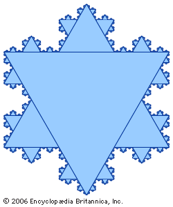
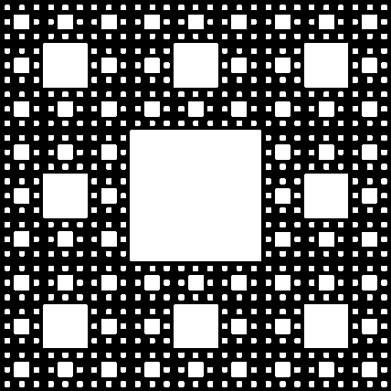

Recently, i started getting interested in fractals. fractals are seeingly never-ending patterns that created by repeating patterns across different scales. in programming, fractals are popular becaause you can create very complex art using only a few lines of code. Some popular examples include the sierinski carpet and the koch snowflake.

Fractals are created using recursions a technique where you create looping through having a function call itself over and over again. I, so far have created a fractal tree and a sierpinski triangle.
